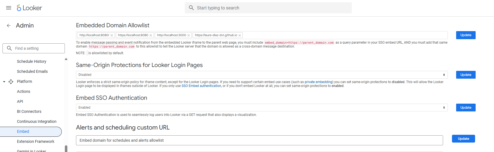
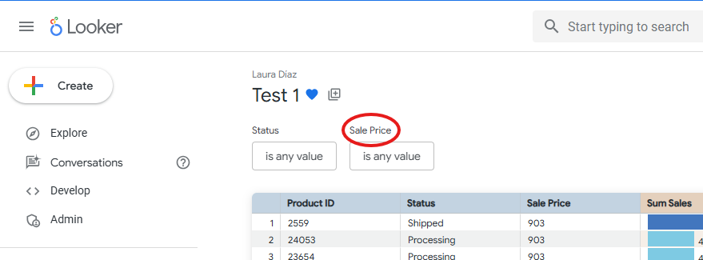

# Looker Dashboard Embed with Filter Inheritance

## Introduction
This project allows **filter inheritance between Looker dashboards** embedded in a web page using HTML and JavaScript.

> Everything that comes **after `<script>`** is responsible for the filter logic and dashboard updates; everything before it is purely presentation.

---

## Important Implementation Notes

### Embed Domain Configuration
The embed URL **must be included in the _Allow Embed Domain_ list** in the Looker Admin panel.  
If the domain is not allowlisted, **filter inheritance between embedded dashboards will not work correctly**.

**Allow Embed Domain configuration (Looker Admin):**




### Forced Looker Authentication
The parameter `&allow_login_screen=true` **forces users to authenticate in Looker** before being able to view the embedded dashboards.  
This is useful when the embed is not using SSO or signed embedding.


### Common Embed Configuration Example

Both requirements are configured directly in the embed URL, as shown below:

```html
<iframe
  id="looker"
  src="https://nubalia.cloud.looker.com/embed/dashboards/356
    ?embed_domain=https://your-allowed-domain.com
    &sdk=3
    &allow_login_screen=true">
</iframe>
```

---

## Steps to Capture a New Filter

To enable inheritance for a new filter between embedded Looker dashboards, follow the steps below.

### 1. Create a variable to store the filter value

First, define a variable that will store the current value of the filter captured from the dashboard. 
This variable will be updated every time the dashboard runs and will be reused when loading another dashboard.

```javascript
let salePriceValue = null
```

### 2. Add the filter to the loadDashboard function

Inside the loadDashboard function, append the filter value to the embed URL if it exists.
This ensures the filter is passed to the next dashboard when switching between dashboards.

```javascript
if (salePriceValue) {
  const encodedSalePrice = encodeURIComponent(salePriceValue)
  baseUrl += `&Sale+Price=${encodedSalePrice}`
}
```

### 3. Capture the filter value in window.addEventListener

Listen for dashboard events and extract the filter value once the dashboard finishes running.

```javascript
const currentSalePrice = filtros?.["Sale Price"]

if (currentSalePrice) {
  salePriceValue = currentSalePrice
}
```

> ⚠️ Important:
The name inside the brackets ("Sale Price") must exactly match the filter name defined in the Looker dashboard (including spaces and capitalization).
>
> 


